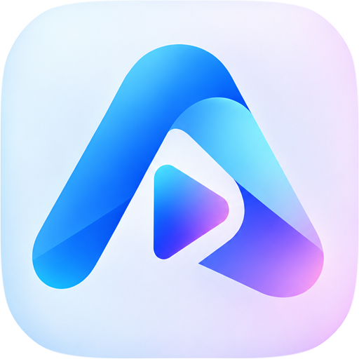
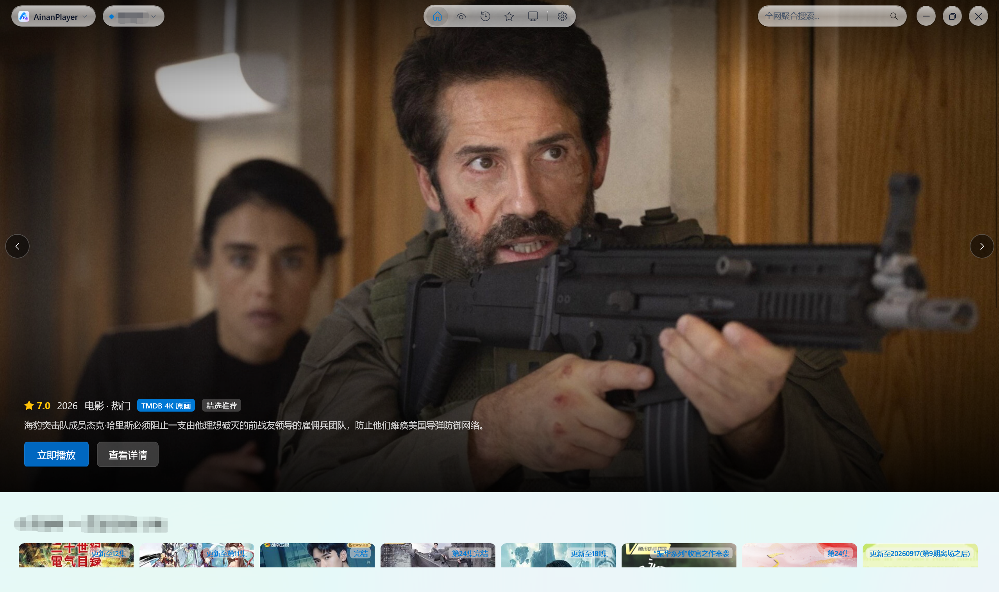
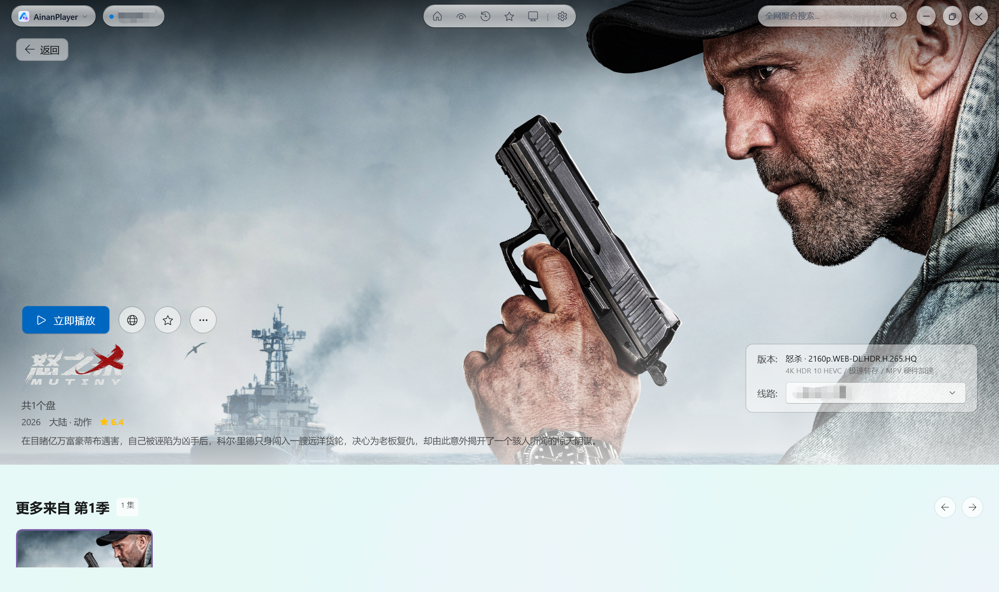

#  AinanPlayer
### Modern Windows 11 Media Aggregation & 4K Hardware-Accelerated Streaming Platform

🌐 **[English](README.md)** | **[简体中文](README_zh.md)**

[**Download**](#download--installation) • [**User Guide**](docs/USER_GUIDE.md) • [**Screenshots**](#interface-preview) • [**Features**](#key-features) • [**Requirements**](#system-requirements) • [**Cloud Authorization**](#cloud-drive-authorization) • [**Community**](#community--feedback) • [**Disclaimer**](#disclaimer) • [**Support**](#support-the-project) • [**Credits**](#credits--acknowledgments)

---

## Interface Preview

### Featured Recommendations & Poster Wall (Apple TV-grade Fluid Motion)

 

### Media Details & Multi-Source Episode Selection (Yaozhi-MPV Hardware Acceleration)

 

### Personalization & Appearance (Seamless Light/Dark Themes & Accent Color Picker)

 

### 4K 60FPS Hardware Acceleration & Live Danmaku Playback (Real-Time Decoding Stats)

---

## Key Features

* **Native WinUI 3 & Fluent Design System**:
  * Built with Windows App SDK 1.6 and native Mica / Acrylic materials, supporting seamless real-time switching between Light, Dark, and System theme modes.
  * **Brand New App Icon & 4 Customizable Styles**: Features an all-new official default "Classic Blue" icon crafted with continuous superellipse curvature ($n=4.8$) and transparent alpha channels. Choose between **Classic Blue**, **Aurora Pink**, **Obsidian Dark**, and **Neon Cyber** in Settings with instant live switching across Windows Taskbar and Title Bar.
* **Universal Multi-Engine Spider Architecture**:
  * Native compatibility with CatVod, TVBox protocol ecosystems, encrypted `.js.md5` and Base64 subscriptions.
  * Isolated multi-port microservice hosting, dynamic hot-loading, and intelligent crawler script caching.
* **Dual Playback Engine Architecture (Built-in + External Customization)**:
  * **Built-in Portable Yaozhi-MPV Engine**: Comes with a self-contained built-in [Yaozhil/mpv-Yaozhi](https://github.com/Yaozhil/mpv-Yaozhi) hardware acceleration environment (`runtime/mpv/mpv.exe`) for out-of-the-box 4K UHD, HEVC/H.265, Dolby Vision, and 60/120FPS ultra-high framerate decoding without requiring any external player setup.
  * **Customizable External Yaozhi-MPV Engine**: Also based on [Yaozhil/mpv-Yaozhi](https://github.com/Yaozhil/mpv-Yaozhi), specify your own external `mpv.exe` path to leverage your personal `mpv.conf`, custom Shaders (Anime4K, FSRCNNX), custom keybindings, and Lua script extensions.
  * **Built-in Offline HLS Player**: Embedded offline `hls.min.js` engine with zero external CDN dependency for lightweight and offline playback.
* **Integrated Cloud Drive Authorization Console**:
  * Scan-to-login QR code console embedded directly within the application for Quark, UC, Alibaba Cloud, Baidu Netdisk, and 115, enabling automated cloud transfer and 4K streaming.
* **Kernel-Level Real-Time Playback Telemetry**:
  * Real-time extraction of actual decoded resolution (e.g., 1080P FHD, 4K UHD), pixel dimensions (`1920×1080`, `3840×2160`), video/audio codecs, and live stream bitrates.
* **Cross-Source Aggregate Search & Filter**:
  * Asynchronous concurrent multi-site searching and multi-level category filtering to discover high-quality media across all active subscription sites.

---

## System Requirements

* **Operating System**: Windows 10 (Version 1809 / Build 17763 or newer) or Windows 11 (64-bit)
* **Runtime Dependencies**: Fully self-contained (all required .NET 8 and Windows App SDK runtimes are bundled; no external installation required)
* **Playback Engine**: Both built-in and external engines are powered by [Yaozhil/mpv-Yaozhi](https://github.com/Yaozhil/mpv-Yaozhi). A portable runtime is bundled out-of-the-box, with optional support for custom external Yaozhi-MPV installations.

---

## Download & Installation

Visit the [**Releases Page**](https://github.com/Ainanya21/AinanPlayer/releases) to download the latest release:

| Package Type | Description | Recommended Usage |
| :--- | :--- | :--- |
| **`AinanPlayer_vX.X.X_Setup.exe`** | Modern graphical setup wizard with custom install path and desktop shortcut | Recommended for most users; supports in-app updates |
| **`AinanPlayer_vX.X.X_Portable.zip`** | Portable standalone green archive | Extract and run directly; ideal for USB drives |

---

## Cloud Drive Authorization

To stream 4K original quality resources from cloud aggregators, authenticate your cloud accounts:

1. Open AinanPlayer and navigate to **"Home Recommendations"** (首页推荐) on the sidebar.
2. In the top source dropdown, select **"Config Center"** (配置中心) (or via "Settings" -> "Cloud Storage Authorization").
3. Use the mobile app of your cloud drive (Quark / UC / Alibaba Cloud / Baidu Netdisk / 115) to scan the QR code.
4. Once authorized, the backend will automatically handle automated transfer and high-speed direct stream parsing.

---

## Community & Feedback

Join our official community channels for subscription updates, discussions, and release announcements:

* **Official Telegram Channel**: [https://t.me/AinanPlayer](https://t.me/AinanPlayer)
* **Telegram Discussion Group**: [https://t.me/AinanPlayerChat](https://t.me/AinanPlayerChat)

---

## Playback Engine & Customization

AinanPlayer hardware acceleration is fully powered by **[Yaozhil/mpv-Yaozhi](https://github.com/Yaozhil/mpv-Yaozhi)**, supporting both **Built-in Out-of-the-Box** and **Customizable External** playback modes:

1. **Default Built-in Playback**: Ready to play immediately upon extracting or installing. Uses the bundled high-performance [Yaozhil/mpv-Yaozhi](https://github.com/Yaozhil/mpv-Yaozhi) hardware acceleration engine (`runtime/mpv/mpv.exe`) with zero third-party dependencies required.
2. **Customizable External Yaozhi-MPV**:
   * Navigate to **"Settings" -> "Playback Engine Settings"**.
   * Toggle on **"Enable External MPV Hardware Acceleration"**.
   * Click **"Browse..."** to select your own [Yaozhil/mpv-Yaozhi](https://github.com/Yaozhil/mpv-Yaozhi) `mpv.exe` path (e.g. `D:\Yaozhi-MPV\mpv.exe`).
   * Click **"Test Launch MPV"** to verify. Playback will then automatically load your external shaders, scripts, and keybindings.
3. **Customizable Application Icons**:
   * Select between **Classic Blue**, **Aurora Pink**, **Obsidian Dark**, or **Neon Cyber** under "Settings" -> "Appearance" to instantly switch the Taskbar and Title Bar icons.

---

## Support the Project

If **AinanPlayer** enhances your multimedia experience, donations to support ongoing development are greatly appreciated:

| WeChat Pay (微信赞赏) | Alipay (支付宝收款) |
| :---: | :---: |
|  |  |

> Your support enables continuous development, ecosystem enhancements, and optimal playback experiences. Thank you! ❤️

---

## Credits & Acknowledgments

This project is built upon or inspired by the following outstanding open-source projects:

* **[mpv](https://mpv.io/) / [mpv-Yaozhi](https://github.com/Yaozhil/mpv-Yaozhi)**: High-performance cross-platform video renderer and hardware decoding core.
* **[WinUI 3](https://github.com/microsoft/WindowsAppSDK) / [Windows App SDK](https://learn.microsoft.com/windows/apps/windows-app-sdk/)**: Microsoft's modern native Windows Fluent Design UI framework.
* **[CatVodSpider / TVBox Protocol Ecosystem](https://github.com/)**: Open multi-source video scraping specifications and crawler protocols.
* **[hls.js](https://github.com/video-dev/hls.js/)**: Native JavaScript HLS client and m3u8 streaming parser.
* **[Fastify](https://fastify.dev/) / [Node.js](https://nodejs.org/)**: High-performance asynchronous microservice framework.
* **[Newtonsoft.Json](https://www.newtonsoft.com/json)**: High-performance JSON serialization for .NET.

---

## Disclaimer

1. **Local Tool Nature**: **AinanPlayer** is strictly a local client and media player built on WinUI 3 and open-source media engines. The software **does not host, store, broadcast, or transmit** any audio, video, subtitle, or image resources.
2. **Third-Party Data Sources**: All subscriptions, site crawlers, cloud accounts, and playback links are **configured or imported by users from third-party public sources**. The developers assume no liability for the validity, legality, accuracy, or availability of third-party sources.
3. **Lawful Usage**: This project is intended for research, programming education, and multimedia technology exchange. Users must comply with local laws and intellectual property rights. Any unauthorized commercial or copyright-infringing use is strictly prohibited.
4. **Copyright Notice**: If any copyright holder believes user-imported third-party sources infringe their rights, please contact the respective third-party hosting service or API provider directly.

---

## License

This project is open source under the [MIT License](LICENSE).
